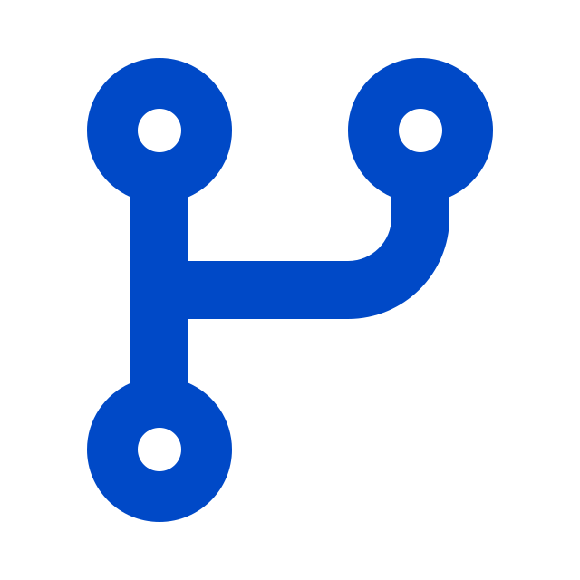

<h1 align="center">Olá 👋, sou Yago Menezes, bem vindo ao meu perfil do GitHub!</h1>
<h3 align="center">Um futuro desenvolvedor Front / Back-end</h3>

   
  

   Atualmente estou trabalhando no projeto [Nexus SixTech](https://github.com/tenmenezes/Nexus_SixTech/)

   Atualmente estou aprendendo **Conexão web com PHP e MySQL / Next.js e React.js**

   Todos os meus projetos estão disponíveis em meu [portfólio](https://tenmenezes.github.io)

   Pergunte-me sobre **POO/Linux/Git**

   Como chegar até mim **yago.ten.menezes@outlook.com**

<h3 align="left"> 🔗 Conecte-se comigo</h3>

<h3 align="left"> ⚒️ Linguagens e Ferramentas</h3>

    <a href="https://www.w3schools.com/cpp/" target="_blank" rel="noreferrer">  </um>    <a href="https://git-scm.com/" target="_blank" rel="noreferrer">  </um>         

<h3 align="left"> 📊 Estatísticas</h3>

&nbsp;

